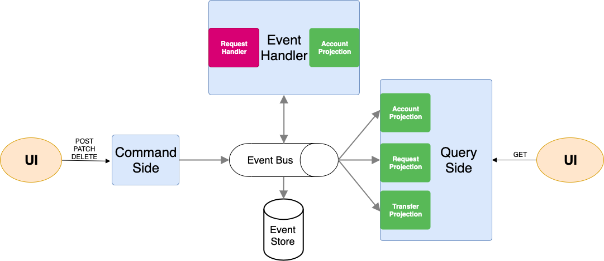
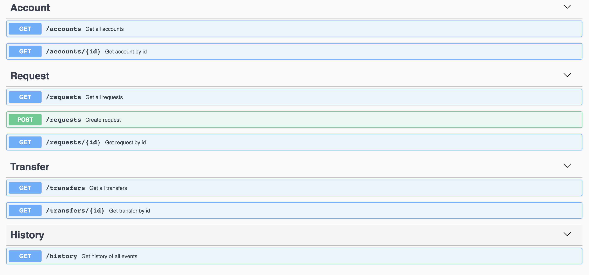

# Money Transfers

## Architecture

Event-driven architecture + CQRS + Event sourcing



PS:
- As you can see from the architecture, It's a **eventually consistent** approach. i.e. at given point of the time maybe the projections are not updated. But, certainly, they will be updated later.
- The purpose of the `Request` resource is to have fully control over what is happening on the system, ex. the system will know how many times someone tried to make a transfer even it's not a successful transfer.

## API Endpoints


## Swagger Documentation Endpoint
`http://localhost:8080/swagger-ui`

## Example Scenarios

- Create account scenario
  - Request to open account through `POST /requests` with body
  ```
  {
    "requestType": "CREATE_ACCOUNT"
  }
  ```
  - You will get a request response with status `Pending` and request id
  - Get the request by id through `GET /requests/:id` and get the created account id from the response (With current business requirements opening a new account is always valid)

- Deposit account scenario
  - Request to deposit account through `POST /requests` with body
  ```
  {
    "requestType": "DEPOSIT_ACCOUNT",
    "accountId": "{ID}",
    "amount": "{AMOUNT}"
  }
  ```
  - You will get a request response with status `Pending` and request id
  - Get the request by id through `GET /requests/:id` and check the response status
  - If `Failure`, you will find the reason. Else, you can query the account through `GET /accounts/:id` and see the balance has been updated

- Transfer money between two accounts scenario
  - Request to transfer money through `POST /requests` with body
  ```
  {
    "requestType": "TRANSFER",
    "fromAccountId": "{ID}",
    "toAccountId": "{ID}",
    "amount": "{AMOUNT}"
  }
  ```
  - You will get a request response with status `Pending` and request id
  - Get the request by id through `GET /requests/:id` and check the response status
  - If `Failure`, you will find the reason. Else, you can query the accounts through `GET /accounts/:id` and see the balance has been updated

- Delete account scenario
  - Request to open account through `POST /requests` with body
  ```
  {
    "requestType": "DELETE_ACCOUNT",
    "accountId": "{ID}"
  }
  ```
  - You will get a request response with status `Pending` and request id
  - Get the request by id through `GET /requests/:id` and check the response status
  - If `Failure`, you will find the reason (accounts can't be deleted with balance more than zero). Else, you can query the accounts through `GET /accounts/:id` and you should get `404`.

## Notes

- At some point I discovered that there are no endpoints to get the account deposits and withdraws. However, I decided not to implement it to show off one of the powerful benefits of this architecture.
So, if at some point in the future we decided to support these features, it will be applicable. As the events is the only source of truth, we just need to create a new projection and load it with all the events from the event store. **We have control over all the system history**.

- This system is mature enough to adopt Microservices/Distributed systems.

- Business logic happens only inside the `Event Handler` component.

- I had the chance to add unit tests only to the `Event Handler` component as the most important part.